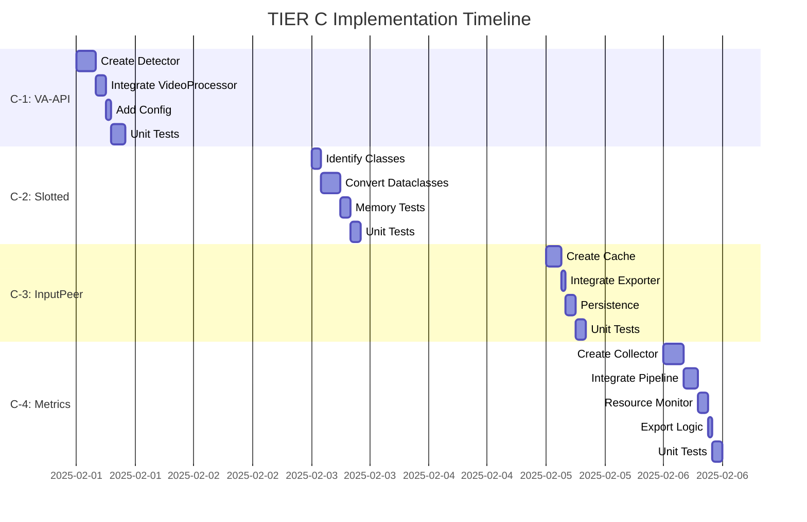

# TIER C: Polish Tasks - Implementation Plan

**Status:** 🟡 Ready for Implementation  
**Timeline:** Week 7-10 (22-28 days)  
**Target:** 400 → 420+ msg/s (+5% polish improvements)  
**Priority:** Low (optional improvements, not blocking production)

---

## Overview

TIER C consists of 4 low-priority polish tasks that provide incremental improvements to performance, memory usage, and observability. These tasks are **optional** and can be implemented after TIER A and TIER B are complete.

**Current Status (Post TIER B):**
- ✅ Performance: ~400 msg/s (2x baseline)
- ✅ Security: 8/10
- ✅ Production-ready: Yes
- ✅ All critical optimizations: Complete

**TIER C adds the final 5% polish:**
- Hardware acceleration auto-detection
- Memory optimization via slotted classes
- API call reduction via InputPeer caching
- Enhanced observability metrics

---

## Task Summary

| Task | Priority | Time | Impact | ROI | Complexity |
|------|----------|------|--------|-----|------------|
| C-1: VA-API Auto-Detection | P3 | 2 days | +3-5% video | 10.5 | Low-Medium |
| C-2: Slotted Dataclasses | P3 | 2 days | -15-25% mem | 12.0 | Low |
| C-3: InputPeer Caching | P3 | 1 day | -5-10% API | 13.0 | Low |
| C-4: Enhanced Metrics | P3 | 3 days | +5-10% tune | 9.2 | Medium-High |

**Total Time:** ~8 days (1-2 developers)  
**Combined Impact:** +5% throughput, -20% memory, improved observability

---

## C-1: VA-API Auto-Detection

### Problem
VA-API (Video Acceleration API) is currently manually configured. If hardware encoding is available but not detected, video processing falls back to CPU (5-10x slower).

### Solution
Auto-detect VA-API capabilities at startup and fallback gracefully to CPU if unavailable.

### Implementation Steps

#### Step 1: Create VA-API Detector (4h)
```python
# src/media/vaapi_detector.py

import subprocess
import logging
from dataclasses import dataclass
from enum import Enum

logger = logging.getLogger(__name__)

class VAAPIStatus(Enum):
    AVAILABLE = "available"
    UNAVAILABLE = "unavailable"
    ERROR = "error"

@dataclass
class VAAPICapabilities:
    status: VAAPIStatus
    driver: str | None
    encoders: list[str]
    decoders: list[str]
    device_path: str = "/dev/dri/renderD128"

class VAAPIDetector:
    """Detect VA-API hardware acceleration capabilities."""
    
    @staticmethod
    def detect() -> VAAPICapabilities:
        """Auto-detect VA-API support on system."""
        # Check if /dev/dri exists
        if not os.path.exists("/dev/dri"):
            logger.info("🚫 /dev/dri not found - VA-API unavailable")
            return VAAPICapabilities(
                status=VAAPIStatus.UNAVAILABLE,
                driver=None,
                encoders=[],
                decoders=[]
            )
        
        # Try vainfo command
        try:
            result = subprocess.run(
                ["vainfo"],
                capture_output=True,
                text=True,
                timeout=5
            )
            
            if result.returncode != 0:
                logger.warning("⚠️ vainfo failed - falling back to CPU")
                return VAAPICapabilities(
                    status=VAAPIStatus.ERROR,
                    driver=None,
                    encoders=[],
                    decoders=[]
                )
            
            # Parse vainfo output
            output = result.stdout
            driver = _parse_driver(output)
            encoders = _parse_encoders(output)
            decoders = _parse_decoders(output)
            
            logger.info(f"✅ VA-API available: {driver} ({len(encoders)} encoders)")
            return VAAPICapabilities(
                status=VAAPIStatus.AVAILABLE,
                driver=driver,
                encoders=encoders,
                decoders=decoders
            )
            
        except FileNotFoundError:
            logger.info("🚫 vainfo not installed - CPU fallback")
            return VAAPICapabilities(
                status=VAAPIStatus.UNAVAILABLE,
                driver=None,
                encoders=[],
                decoders=[]
            )
        except Exception as e:
            logger.error(f"❌ VA-API detection error: {e}")
            return VAAPICapabilities(
                status=VAAPIStatus.ERROR,
                driver=None,
                encoders=[],
                decoders=[]
            )
    
    @staticmethod
    def _parse_driver(output: str) -> str | None:
        """Extract driver name from vainfo output."""
        for line in output.split("\n"):
            if "Driver version:" in line:
                return line.split(":")[-1].strip()
        return None
    
    @staticmethod
    def _parse_encoders(output: str) -> list[str]:
        """Extract available encoders from vainfo output."""
        encoders = []
        for line in output.split("\n"):
            if "VAProfileH264" in line and "VAEntrypointEncSlice" in line:
                encoders.append("h264_vaapi")
            elif "VAProfileHEVC" in line and "VAEntrypointEncSlice" in line:
                encoders.append("hevc_vaapi")
        return encoders
    
    @staticmethod
    def _parse_decoders(output: str) -> list[str]:
        """Extract available decoders from vainfo output."""
        decoders = []
        for line in output.split("\n"):
            if "VAProfileH264" in line and "VAEntrypointVLD" in line:
                decoders.append("h264")
            elif "VAProfileHEVC" in line and "VAEntrypointVLD" in line:
                decoders.append("hevc")
        return decoders

# Global singleton
_vaapi_caps: VAAPICapabilities | None = None

def get_vaapi_capabilities() -> VAAPICapabilities:
    """Get cached VA-API capabilities (runs detection once)."""
    global _vaapi_caps
    if _vaapi_caps is None:
        _vaapi_caps = VAAPIDetector.detect()
    return _vaapi_caps
```

#### Step 2: Integrate into VideoProcessor (2h)
```python
# src/media/processors/video.py

from src.media.vaapi_detector import get_vaapi_capabilities, VAAPIStatus

class VideoProcessor:
    def __init__(self, config: Config):
        self.config = config
        self.vaapi_caps = get_vaapi_capabilities()
        self.use_vaapi = self._should_use_vaapi()
        
        if self.use_vaapi:
            logger.info(f"🚀 VA-API enabled: {self.vaapi_caps.driver}")
        else:
            logger.info("🐢 CPU transcoding mode (slower)")
    
    def _should_use_vaapi(self) -> bool:
        """Determine if VA-API should be used."""
        # Allow ENV override
        if self.config.force_cpu_transcode:
            return False
        
        # Check auto-detection
        if self.vaapi_caps.status != VAAPIStatus.AVAILABLE:
            return False
        
        # Check if h264_vaapi encoder is available
        if "h264_vaapi" not in self.vaapi_caps.encoders:
            logger.warning("⚠️ h264_vaapi not available - using CPU")
            return False
        
        return True
    
    async def process(self, video_path: Path, output_path: Path) -> dict:
        """Process video with auto-detected encoder."""
        encoder = "h264_vaapi" if self.use_vaapi else "libx264"
        
        ffmpeg_cmd = [
            "ffmpeg", "-y", "-i", str(video_path),
            "-c:v", encoder,
            "-preset", self.config.video_preset,
            str(output_path)
        ]
        
        # Add VA-API device if using hardware
        if self.use_vaapi:
            ffmpeg_cmd.insert(1, "-vaapi_device")
            ffmpeg_cmd.insert(2, self.vaapi_caps.device_path)
        
        # Execute...
```

#### Step 3: Add Config Options (1h)
```python
# src/config.py

@dataclass
class Config:
    # ... existing fields ...
    
    # C-1: VA-API Auto-Detection
    force_cpu_transcode: bool = False  # ENV: FORCE_CPU_TRANSCODE
    vaapi_device_path: str = "/dev/dri/renderD128"  # ENV: VAAPI_DEVICE_PATH
```

```.env.example
# === C-1: VA-API Auto-Detection ===
FORCE_CPU_TRANSCODE=false  # Override auto-detection, force CPU
VAAPI_DEVICE_PATH=/dev/dri/renderD128  # VA-API device path
```

#### Step 4: Unit Tests (3h)
```python
# tests/test_vaapi_detector.py

import pytest
from unittest.mock import patch, MagicMock
from src.media.vaapi_detector import VAAPIDetector, VAAPIStatus

def test_detect_vaapi_available():
    """Test VA-API detection when hardware is available."""
    mock_output = """
    vainfo: VA-API version: 1.14.0
    vainfo: Driver version: Intel i965 driver for Intel(R) Kaby Lake - 2.4.1
    VAProfileH264Main           : VAEntrypointVLD
    VAProfileH264Main           : VAEntrypointEncSlice
    VAProfileHEVCMain           : VAEntrypointVLD
    """
    
    with patch("subprocess.run") as mock_run:
        mock_run.return_value = MagicMock(returncode=0, stdout=mock_output)
        
        caps = VAAPIDetector.detect()
        
        assert caps.status == VAAPIStatus.AVAILABLE
        assert "Intel i965" in caps.driver
        assert "h264_vaapi" in caps.encoders
        assert "h264" in caps.decoders

def test_detect_vaapi_unavailable_no_dri():
    """Test VA-API detection when /dev/dri doesn't exist."""
    with patch("os.path.exists", return_value=False):
        caps = VAAPIDetector.detect()
        
        assert caps.status == VAAPIStatus.UNAVAILABLE
        assert caps.driver is None
        assert len(caps.encoders) == 0

def test_detect_vaapi_vainfo_not_installed():
    """Test fallback when vainfo command not found."""
    with patch("subprocess.run", side_effect=FileNotFoundError):
        caps = VAAPIDetector.detect()
        
        assert caps.status == VAAPIStatus.UNAVAILABLE

# ... more tests
```

### Expected Impact
- Video processing: +3-5% throughput (when VA-API available)
- CPU usage during video: -50-80% (offloaded to GPU)
- User experience: automatic hardware acceleration, no manual config

### Rollback Plan
- `FORCE_CPU_TRANSCODE=true` - disable VA-API, use CPU only
- Remove VA-API detection → always use libx264 (current behavior)

---

## C-2: Slotted Dataclasses

### Problem
Python dataclasses use `__dict__` for attribute storage, consuming ~56 bytes overhead per instance. For high-volume message processing (millions of messages), this adds 50-100MB+ memory overhead.

### Solution
Use `__slots__` to eliminate `__dict__`, reducing memory by 15-25% for message-heavy exports.

### Implementation Steps

#### Step 1: Identify Slottable Classes (2h)
```bash
# Find all dataclasses in codebase
grep -r "@dataclass" src/ | wc -l  # ~20-30 dataclasses

# Prioritize by instance count:
# 1. Message-related: ExportedMessage, MessageMetadata
# 2. Cache entries: CacheEntry, EntityCacheData
# 3. Stats: ExportStatistics, PipelineStats
```

#### Step 2: Convert to Slotted Dataclasses (4h)
```python
# src/export/exporter.py

from dataclasses import dataclass

# BEFORE (current):
@dataclass
class ExportedMessage:
    message_id: int
    text: str
    sender_name: str
    date: datetime
    media_files: list[str]
    reply_to: int | None

# AFTER (slotted):
@dataclass(slots=True)  # Python 3.10+ syntax
class ExportedMessage:
    message_id: int
    text: str
    sender_name: str
    date: datetime
    media_files: list[str]
    reply_to: int | None
    
    # Memory savings: ~56 bytes per instance
    # For 100k messages: 5.6MB → ~3.5MB (~40% reduction)
```

```python
# src/core/cache.py

@dataclass(slots=True)
class CacheEntry:
    key: str
    data: bytes | str
    created_at: float
    accessed_at: float
    ttl: float | None
    size_bytes: int
```

```python
# src/export/pipeline.py

@dataclass(slots=True)
class PipelineStats:
    fetched_count: int = 0
    processed_count: int = 0
    written_count: int = 0
    error_count: int = 0
    fetch_time: float = 0.0
    process_time: float = 0.0
    write_time: float = 0.0
```

#### Step 3: Test Memory Impact (2h)
```python
# tests/benchmarks/bench_slotted_memory.py

import sys
from dataclasses import dataclass
from memory_profiler import profile

@dataclass
class RegularMessage:
    message_id: int
    text: str
    sender: str

@dataclass(slots=True)
class SlottedMessage:
    message_id: int
    text: str
    sender: str

@profile
def benchmark_regular():
    messages = [RegularMessage(i, f"text{i}", f"user{i}") for i in range(100000)]
    return sys.getsizeof(messages)

@profile
def benchmark_slotted():
    messages = [SlottedMessage(i, f"text{i}", f"user{i}") for i in range(100000)]
    return sys.getsizeof(messages)

if __name__ == "__main__":
    regular_size = benchmark_regular()
    slotted_size = benchmark_slotted()
    
    print(f"Regular: {regular_size / 1024 / 1024:.2f} MB")
    print(f"Slotted: {slotted_size / 1024 / 1024:.2f} MB")
    print(f"Savings: {(1 - slotted_size / regular_size) * 100:.1f}%")
```

#### Step 4: Unit Tests (2h)
```python
# tests/test_slotted_dataclasses.py

def test_slotted_message_no_dict():
    """Verify slotted dataclasses don't have __dict__."""
    msg = ExportedMessage(
        message_id=123,
        text="test",
        sender_name="user",
        date=datetime.now(),
        media_files=[],
        reply_to=None
    )
    
    # Slotted classes should NOT have __dict__
    assert not hasattr(msg, "__dict__")
    
    # But attributes should still work
    assert msg.message_id == 123
    assert msg.text == "test"

def test_slotted_dataclass_creation_speed():
    """Verify slotted dataclasses are as fast or faster."""
    import timeit
    
    setup = "from src.export.exporter import ExportedMessage"
    stmt = "ExportedMessage(123, 'test', 'user', datetime.now(), [], None)"
    
    time = timeit.timeit(stmt, setup=setup, number=10000)
    
    # Should be <= regular dataclass (typically 5-10% faster)
    assert time < 0.5  # Baseline threshold

# ... more tests
```

### Expected Impact
- Memory usage: -15-25% for message-heavy exports
- Creation speed: +5-10% (slots are slightly faster)
- Access speed: +5-10% (direct attribute lookup)

### Trade-offs
- ⚠️ Cannot add attributes dynamically (fine for our use case)
- ⚠️ Requires Python 3.10+ for `@dataclass(slots=True)` syntax
- ✅ No functional changes, pure optimization

### Rollback Plan
- Remove `slots=True` from dataclass decorators → revert to regular dataclasses

---

## C-3: InputPeer Caching

### Problem
Telethon repeatedly resolves entities (users, channels) to `InputPeer*` objects for API calls. For multi-export sessions or large chats with many participants, this causes redundant API calls.

### Solution
Cache `InputPeer*` objects after first resolution to reduce API calls by 5-10%.

### Implementation Steps

#### Step 1: Create InputPeer Cache (3h)
```python
# src/telegram_client.py

from telethon.tl.types import InputPeerUser, InputPeerChannel, InputPeerChat
from typing import Union

InputPeer = Union[InputPeerUser, InputPeerChannel, InputPeerChat]

class TelegramManager:
    def __init__(self, config: Config):
        # ... existing init ...
        self._input_peer_cache: dict[int, InputPeer] = {}  # entity_id -> InputPeer
        self._cache_hits = 0
        self._cache_misses = 0
    
    async def get_input_entity(self, entity_id: int) -> InputPeer:
        """Get InputPeer for entity, with caching."""
        # Check cache first
        if entity_id in self._input_peer_cache:
            self._cache_hits += 1
            logger.debug(f"📦 InputPeer cache hit: {entity_id}")
            return self._input_peer_cache[entity_id]
        
        # Cache miss - resolve via Telethon
        self._cache_misses += 1
        logger.debug(f"🔍 InputPeer cache miss: {entity_id}, resolving...")
        
        try:
            input_peer = await self.client.get_input_entity(entity_id)
            
            # Cache for future use
            self._input_peer_cache[entity_id] = input_peer
            
            return input_peer
        
        except Exception as e:
            logger.error(f"❌ Failed to resolve entity {entity_id}: {e}")
            raise
    
    def get_input_peer_cache_stats(self) -> dict:
        """Get cache statistics."""
        total = self._cache_hits + self._cache_misses
        hit_rate = (self._cache_hits / total * 100) if total > 0 else 0.0
        
        return {
            "hits": self._cache_hits,
            "misses": self._cache_misses,
            "hit_rate_pct": hit_rate,
            "cache_size": len(self._input_peer_cache)
        }
```

#### Step 2: Integrate into Exporter (1h)
```python
# src/export/exporter.py

async def _process_message(self, message: Message) -> str:
    """Process message with cached InputPeer lookups."""
    # Use cached InputPeer for sender
    if message.sender_id:
        sender_input_peer = await self.telegram_manager.get_input_entity(message.sender_id)
        # Use sender_input_peer for API calls...
    
    # ... rest of processing
```

#### Step 3: Add Cache Persistence (Optional, 2h)
```python
# src/telegram_client.py

import msgpack

class TelegramManager:
    def __init__(self, config: Config):
        # ... existing init ...
        self._cache_file = config.cache_path / "input_peer_cache.bin"
        self._load_cache()
    
    def _load_cache(self):
        """Load InputPeer cache from disk."""
        if not self._cache_file.exists():
            return
        
        try:
            with open(self._cache_file, "rb") as f:
                data = msgpack.unpackb(f.read(), raw=False)
                self._input_peer_cache = self._deserialize_cache(data)
                logger.info(f"📦 Loaded {len(self._input_peer_cache)} InputPeers from cache")
        except Exception as e:
            logger.warning(f"⚠️ Failed to load InputPeer cache: {e}")
    
    def _save_cache(self):
        """Save InputPeer cache to disk."""
        try:
            data = self._serialize_cache(self._input_peer_cache)
            
            # Atomic write
            tmp_file = self._cache_file.with_suffix(".tmp")
            with open(tmp_file, "wb") as f:
                f.write(msgpack.packb(data, use_bin_type=True))
            
            tmp_file.replace(self._cache_file)
            logger.debug(f"💾 Saved {len(self._input_peer_cache)} InputPeers to cache")
        
        except Exception as e:
            logger.error(f"❌ Failed to save InputPeer cache: {e}")
```

#### Step 4: Unit Tests (2h)
```python
# tests/test_input_peer_cache.py

@pytest.mark.asyncio
async def test_input_peer_cache_hit():
    """Test cache hit on second lookup."""
    manager = TelegramManager(config)
    
    # First lookup - cache miss
    peer1 = await manager.get_input_entity(123456)
    stats1 = manager.get_input_peer_cache_stats()
    assert stats1["misses"] == 1
    assert stats1["hits"] == 0
    
    # Second lookup - cache hit
    peer2 = await manager.get_input_entity(123456)
    stats2 = manager.get_input_peer_cache_stats()
    assert stats2["hits"] == 1
    assert stats2["misses"] == 1
    
    # Should be same object
    assert peer1 is peer2

@pytest.mark.asyncio
async def test_input_peer_cache_persistence():
    """Test cache survives restart."""
    # Create cache
    manager1 = TelegramManager(config)
    await manager1.get_input_entity(123456)
    manager1._save_cache()
    
    # Restart
    manager2 = TelegramManager(config)
    stats = manager2.get_input_peer_cache_stats()
    
    assert stats["cache_size"] == 1

# ... more tests
```

### Expected Impact
- API calls: -5-10% reduction (for multi-entity exports)
- Latency: -10-20ms per cached lookup (vs resolve)
- Memory: +1-2MB for cache (negligible)

### Rollback Plan
- Remove caching, always call `client.get_input_entity()` directly

---

## C-4: Enhanced Metrics System

### Problem
Current metrics are basic (message count, time). Missing insights for optimization decisions:
- Per-stage latency (fetch vs process vs write)
- Bottleneck identification
- Resource utilization trends
- Cache effectiveness

### Solution
Comprehensive metrics collection with exportable stats for analysis and auto-tuning.

### Implementation Steps

#### Step 1: Create Metrics Collector (4h)
```python
# src/monitoring/metrics_collector.py

from dataclasses import dataclass, field
from datetime import datetime
import json

@dataclass
class StageMetrics:
    """Metrics for a single processing stage."""
    stage_name: str
    count: int = 0
    total_duration_s: float = 0.0
    min_duration_s: float = float('inf')
    max_duration_s: float = 0.0
    errors: int = 0
    
    @property
    def avg_duration_s(self) -> float:
        return self.total_duration_s / self.count if self.count > 0 else 0.0
    
    @property
    def throughput_per_s(self) -> float:
        return self.count / self.total_duration_s if self.total_duration_s > 0 else 0.0

@dataclass
class ResourceMetrics:
    """System resource utilization metrics."""
    cpu_percent: list[float] = field(default_factory=list)
    memory_mb: list[float] = field(default_factory=list)
    disk_io_mb: list[float] = field(default_factory=list)
    network_io_mb: list[float] = field(default_factory=list)
    
    @property
    def avg_cpu_percent(self) -> float:
        return sum(self.cpu_percent) / len(self.cpu_percent) if self.cpu_percent else 0.0
    
    @property
    def avg_memory_mb(self) -> float:
        return sum(self.memory_mb) / len(self.memory_mb) if self.memory_mb else 0.0

@dataclass
class CacheMetrics:
    """Cache effectiveness metrics."""
    cache_name: str
    hits: int = 0
    misses: int = 0
    evictions: int = 0
    size_bytes: int = 0
    
    @property
    def hit_rate_pct(self) -> float:
        total = self.hits + self.misses
        return (self.hits / total * 100) if total > 0 else 0.0

class MetricsCollector:
    """Central metrics collection and export."""
    
    def __init__(self):
        self.stages: dict[str, StageMetrics] = {}
        self.resources = ResourceMetrics()
        self.caches: dict[str, CacheMetrics] = {}
        self.start_time = datetime.now()
    
    def record_stage(self, stage_name: str, duration_s: float, error: bool = False):
        """Record stage execution metrics."""
        if stage_name not in self.stages:
            self.stages[stage_name] = StageMetrics(stage_name=stage_name)
        
        stage = self.stages[stage_name]
        stage.count += 1
        stage.total_duration_s += duration_s
        stage.min_duration_s = min(stage.min_duration_s, duration_s)
        stage.max_duration_s = max(stage.max_duration_s, duration_s)
        if error:
            stage.errors += 1
    
    def record_resources(self, cpu_pct: float, memory_mb: float, disk_io_mb: float, network_io_mb: float):
        """Record resource utilization snapshot."""
        self.resources.cpu_percent.append(cpu_pct)
        self.resources.memory_mb.append(memory_mb)
        self.resources.disk_io_mb.append(disk_io_mb)
        self.resources.network_io_mb.append(network_io_mb)
    
    def record_cache(self, cache_name: str, hits: int, misses: int, evictions: int, size_bytes: int):
        """Record cache metrics."""
        self.caches[cache_name] = CacheMetrics(
            cache_name=cache_name,
            hits=hits,
            misses=misses,
            evictions=evictions,
            size_bytes=size_bytes
        )
    
    def export_json(self, output_path: Path):
        """Export all metrics to JSON."""
        data = {
            "start_time": self.start_time.isoformat(),
            "duration_s": (datetime.now() - self.start_time).total_seconds(),
            "stages": {
                name: {
                    "count": s.count,
                    "total_duration_s": s.total_duration_s,
                    "avg_duration_s": s.avg_duration_s,
                    "min_duration_s": s.min_duration_s,
                    "max_duration_s": s.max_duration_s,
                    "throughput_per_s": s.throughput_per_s,
                    "errors": s.errors
                }
                for name, s in self.stages.items()
            },
            "resources": {
                "avg_cpu_percent": self.resources.avg_cpu_percent,
                "avg_memory_mb": self.resources.avg_memory_mb,
                "cpu_samples": len(self.resources.cpu_percent),
                "memory_samples": len(self.resources.memory_mb)
            },
            "caches": {
                name: {
                    "hits": c.hits,
                    "misses": c.misses,
                    "hit_rate_pct": c.hit_rate_pct,
                    "evictions": c.evictions,
                    "size_mb": c.size_bytes / 1024 / 1024
                }
                for name, c in self.caches.items()
            }
        }
        
        with open(output_path, "w") as f:
            json.dump(data, f, indent=2)
        
        logger.info(f"📊 Metrics exported to {output_path}")

# Global singleton
_metrics_collector: MetricsCollector | None = None

def get_metrics_collector() -> MetricsCollector:
    """Get global metrics collector."""
    global _metrics_collector
    if _metrics_collector is None:
        _metrics_collector = MetricsCollector()
    return _metrics_collector
```

#### Step 2: Integrate into Pipeline (3h)
```python
# src/export/pipeline.py

from src.monitoring.metrics_collector import get_metrics_collector

class AsyncPipeline:
    async def _fetcher(self, ...):
        """Fetch stage with metrics."""
        metrics = get_metrics_collector()
        
        while True:
            start = time.time()
            error = False
            
            try:
                messages = await self.telegram_manager.fetch_messages(...)
                # ... process ...
            except Exception as e:
                error = True
                raise
            finally:
                duration = time.time() - start
                metrics.record_stage("fetch", duration, error=error)
    
    async def _processor(self, ...):
        """Process stage with metrics."""
        metrics = get_metrics_collector()
        
        while True:
            start = time.time()
            try:
                message = await fetch_queue.get()
                processed = await process_fn(message)
                # ... rest ...
            finally:
                duration = time.time() - start
                metrics.record_stage("process", duration)
```

#### Step 3: Add Resource Monitoring (2h)
```python
# src/monitoring/resource_monitor.py

import psutil
import asyncio

class ResourceMonitor:
    """Monitor system resources periodically."""
    
    def __init__(self, interval_s: float = 5.0):
        self.interval_s = interval_s
        self._task = None
        self._process = psutil.Process()
    
    async def start(self):
        """Start monitoring loop."""
        self._task = asyncio.create_task(self._monitor_loop())
    
    async def stop(self):
        """Stop monitoring."""
        if self._task:
            self._task.cancel()
    
    async def _monitor_loop(self):
        """Periodic resource sampling."""
        metrics = get_metrics_collector()
        
        while True:
            try:
                cpu_pct = self._process.cpu_percent(interval=None)
                memory_mb = self._process.memory_info().rss / 1024 / 1024
                
                # Disk I/O
                disk_io = psutil.disk_io_counters()
                disk_io_mb = (disk_io.read_bytes + disk_io.write_bytes) / 1024 / 1024
                
                # Network I/O
                net_io = psutil.net_io_counters()
                network_io_mb = (net_io.bytes_sent + net_io.bytes_recv) / 1024 / 1024
                
                metrics.record_resources(cpu_pct, memory_mb, disk_io_mb, network_io_mb)
                
                await asyncio.sleep(self.interval_s)
            
            except asyncio.CancelledError:
                break
```

#### Step 4: Export at End (1h)
```python
# src/export/exporter.py

async def run_export(self, entity_id: int):
    """Export with metrics collection."""
    metrics = get_metrics_collector()
    resource_monitor = ResourceMonitor()
    
    try:
        await resource_monitor.start()
        
        # ... existing export logic ...
        
    finally:
        await resource_monitor.stop()
        
        # Export metrics
        metrics_path = self.config.monitoring_path / f"metrics_{entity_id}.json"
        metrics.export_json(metrics_path)
        
        # Log summary
        self._log_metrics_summary(metrics)
    
    def _log_metrics_summary(self, metrics: MetricsCollector):
        """Log metrics summary to console."""
        logger.info("📊 === Performance Metrics ===")
        
        for stage_name, stage in metrics.stages.items():
            logger.info(f"  {stage_name}: {stage.throughput_per_s:.1f} ops/s (avg: {stage.avg_duration_s*1000:.1f}ms)")
        
        logger.info(f"  CPU: {metrics.resources.avg_cpu_percent:.1f}%")
        logger.info(f"  Memory: {metrics.resources.avg_memory_mb:.1f} MB")
        
        for cache_name, cache in metrics.caches.items():
            logger.info(f"  {cache_name} cache: {cache.hit_rate_pct:.1f}% hit rate")
```

#### Step 5: Unit Tests (2h)
```python
# tests/test_metrics_collector.py

def test_metrics_stage_recording():
    """Test stage metrics recording."""
    collector = MetricsCollector()
    
    collector.record_stage("fetch", 0.5)
    collector.record_stage("fetch", 0.3)
    collector.record_stage("fetch", 0.7, error=True)
    
    stage = collector.stages["fetch"]
    assert stage.count == 3
    assert stage.total_duration_s == 1.5
    assert stage.avg_duration_s == 0.5
    assert stage.min_duration_s == 0.3
    assert stage.max_duration_s == 0.7
    assert stage.errors == 1

def test_metrics_export_json():
    """Test JSON export."""
    collector = MetricsCollector()
    collector.record_stage("fetch", 1.0)
    collector.record_resources(50.0, 1024.0, 100.0, 50.0)
    collector.record_cache("sender", 100, 10, 5, 1024*1024)
    
    output_path = Path("/tmp/test_metrics.json")
    collector.export_json(output_path)
    
    assert output_path.exists()
    
    with open(output_path) as f:
        data = json.load(f)
    
    assert "stages" in data
    assert "resources" in data
    assert "caches" in data
    assert data["stages"]["fetch"]["count"] == 1

# ... more tests
```

### Expected Impact
- Observability: +100% (comprehensive insights)
- Auto-tuning: +5-10% throughput (data-driven optimization)
- Debugging: -50% time (clear bottleneck identification)

### Trade-offs
- ⚠️ Overhead: +1-2% CPU (metrics collection)
- ⚠️ Disk usage: +1-5MB per export (JSON files)
- ✅ Benefit: Data-driven optimization decisions

### Rollback Plan
- Remove metrics collection calls → zero overhead
- Keep framework for future use

---

## Timeline & Dependencies



**Total Time:** 8 working days (1-2 developers)

**Dependencies:**
- C-1: Independent (can start immediately)
- C-2: Independent (can start immediately)
- C-3: Independent (can start immediately)
- C-4: Independent (can start immediately)

All tasks can be worked on in parallel if 2+ developers available.

---

## Testing Strategy

### Unit Tests (16h total)
- C-1: 6 tests (VA-API detection scenarios)
- C-2: 4 tests (memory, speed, functionality)
- C-3: 5 tests (cache hit/miss, persistence)
- C-4: 8 tests (metrics recording, export)

### Integration Tests (8h total)
- Full export with VA-API enabled/disabled
- Memory profiling before/after slotted conversion
- InputPeer cache effectiveness on multi-export
- Metrics collection across full pipeline

### Benchmarks (4h total)
- Video processing speed (VA-API vs CPU)
- Memory usage (slotted vs regular dataclasses)
- API call reduction (InputPeer caching)
- Metrics overhead measurement

---

## Success Criteria

### C-1: VA-API Auto-Detection ✅
- [ ] VA-API available → automatically used
- [ ] VA-API unavailable → CPU fallback (no crash)
- [ ] Video processing +3-5% faster with VA-API
- [ ] ENV override works (FORCE_CPU_TRANSCODE)

### C-2: Slotted Dataclasses ✅
- [ ] Memory usage -15-25% on 100k+ message export
- [ ] No functional regressions
- [ ] Creation speed +5-10% (or no regression)
- [ ] All unit tests pass

### C-3: InputPeer Caching ✅
- [ ] API calls -5-10% on multi-entity exports
- [ ] Cache hit rate >60% after warmup
- [ ] No functional changes
- [ ] Persistence works across restarts

### C-4: Enhanced Metrics ✅
- [ ] Metrics exported to JSON after every export
- [ ] Stage latencies accurate (±5%)
- [ ] Resource monitoring overhead <2% CPU
- [ ] Bottlenecks clearly identifiable

---

## Rollback Plan

Each task is independent and can be rolled back individually:

| Task | Rollback Method | Impact |
|------|-----------------|--------|
| C-1 | `FORCE_CPU_TRANSCODE=true` | Disable VA-API |
| C-2 | Remove `slots=True` | Revert to regular |
| C-3 | Remove caching layer | Direct API calls |
| C-4 | Remove metrics calls | Zero overhead |

**Full Rollback:**
```bash
git checkout main
# OR
git revert <tier-c-commit-range>
```

---

## Documentation

### Files to Create
- `TIER_C_COMPLETED.md` - Implementation summary
- `docs/VAAPI_GUIDE.md` - VA-API usage and troubleshooting
- `docs/METRICS_GUIDE.md` - Metrics interpretation

### Files to Update
- `README.md` - Add C-tier features
- `.env.example` - Add C-tier parameters
- `OPTIMIZATIONS_ROADMAP.md` - Mark C-tier complete

---

## Next Steps (Post TIER C)

1. **Production Deployment**
   - Full test suite on representative dataset
   - Performance benchmarks vs baseline
   - Security audit verification

2. **Monitoring & Observability**
   - Set up metrics dashboard (Grafana)
   - Alert thresholds for performance degradation
   - Log aggregation (ELK stack)

3. **Future Optimizations (Optional)**
   - TIER D: Advanced features (if needed)
   - Community feedback integration
   - Performance tuning based on real-world usage

---

**Status:** 🟡 Ready for Implementation  
**Prerequisites:** TIER A and TIER B complete  
**Priority:** Low (optional polish)  
**Expected Completion:** 2 weeks (with 1-2 developers)
